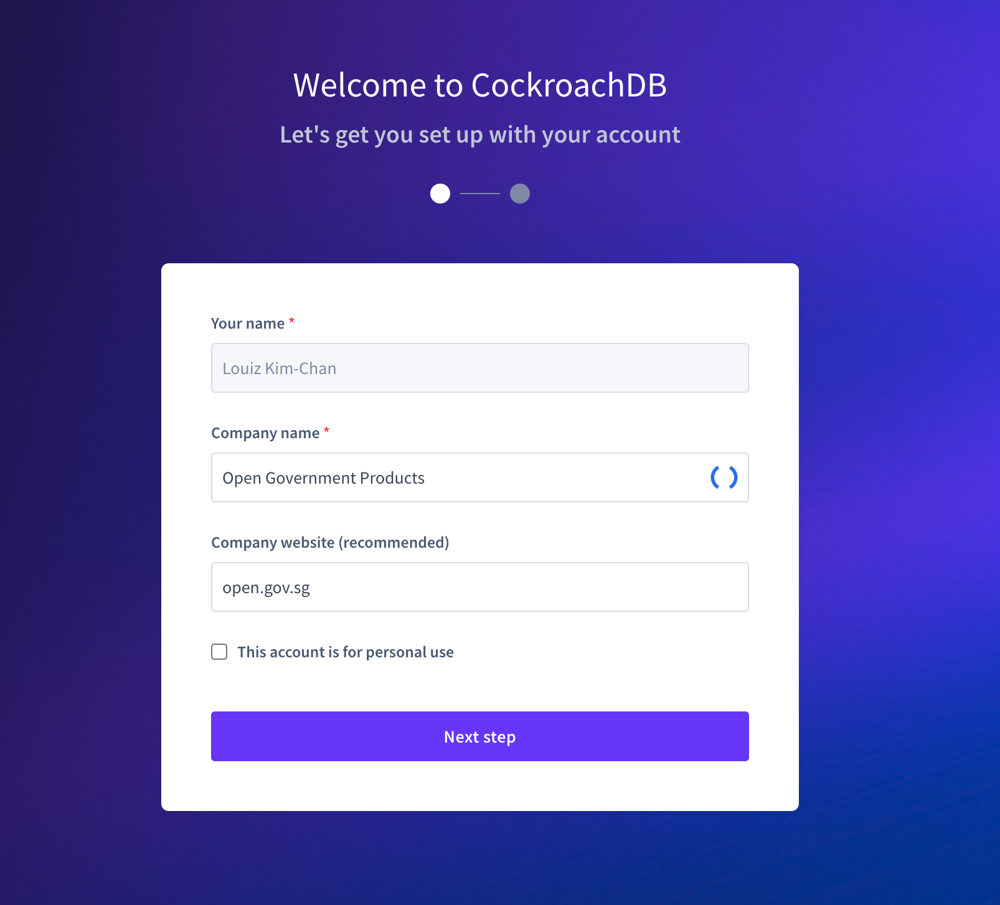
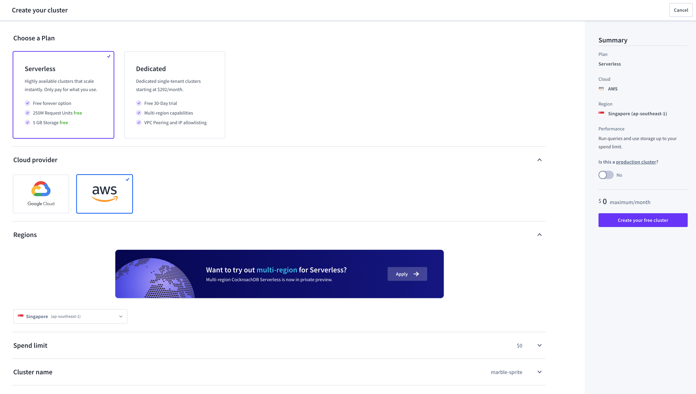
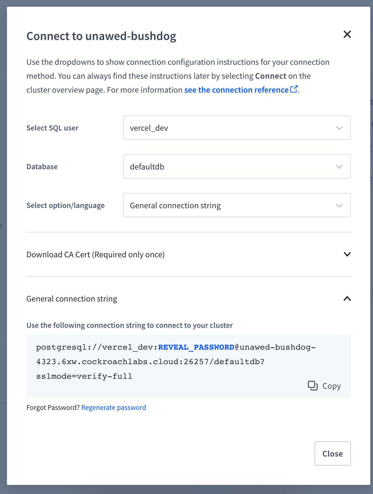

# Setting up Serverless CockroachDB cluster

1. Go to https://www.cockroachlabs.com/lp/serverless/
1. Login and create your account. Set your Company Name to your project name.
   
1. Create a free serverless cluster with AWS as provider and Singapore as region
   
1. Create a sql user. Set it to anything other than `root`.
   
1. Save connection string. You don't need to install the CA root cert. See [link](https://www.cockroachlabs.com/docs/cockroachcloud/serverless-faqs.html#what-certificates-do-i-need-to-connect-to-my-cluster)
   - The `DATABASE_URL` environment variable in Starter Kit should be set to this connection string
