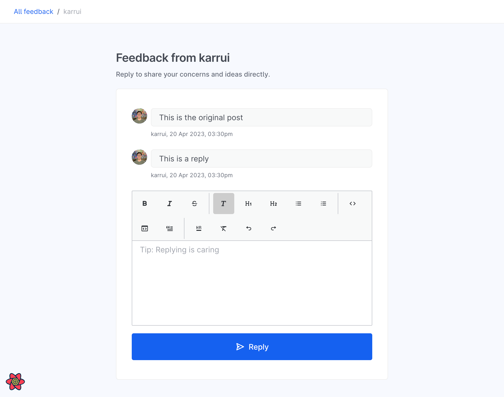

# Example Feature: allowing replies on posts

> 🗒️ This feature is already in the application, but here as documentation on how one could approach the problem.
> If you want to follow along, you can check out the [`examples/no-replies`](https://github.com/opengovsg/starter-kit/tree/examples/no-replies) branch that does not have this feature yet to follow along. Needed changes are marked with `TODO(example)`, or you may see the commit history for the changes needed.

There are usually 3 main parts to adding a feature:

- Making schema changes to the database (if needed)
- Updating application tRPC routers ("backend" code)
- Using new procedure in the application ("frontend" code)

This document will describe the flow of adding such a feature to the application.

### Refresher

As a refresher, this application uses the the following technologies and frameworks:

- [Next.js](https://nextjs.org/) for the React framework
  - A lightly opinionated, heavily optimised framework for building React applications without requiring a separate backend.
- [tRPC](https://trpc.io/) for the application API layer
  - Allows end-to-end typesafe APIs, with a focus on developer experience.
- [Prisma](https://www.prisma.io/) for the database ORM
  - A database toolkit that allows for easy database schema migrations, and a typesafe database client. Works extremely well with tRPC.

For more information on the technologies used, refer to the [Technologies README](../technology.md).

## What we will be implementing

> 🗒️ Screenshots may look different from the actual application.



There will be mainly changes to the following files:

1. `prisma/schema.prisma`
   - to add new fields to the `Post` model to accommodate replies
2. `src/server/modules/thread/thread.router.ts`
   - to add a new `reply` procedure

There will also be new components to allow for the client to invoke the new procedure.

---

## Making schema changes to the database

We use Prisma as the database ORM for the application layer, and CockroachDB for the database layer.

#### Related documentation

- [Prisma data model](https://www.prisma.io/docs/concepts/components/prisma-schema/data-model)
- [Prisma schema file](https://www.prisma.io/docs/concepts/components/prisma-schema)
- [Prisma relations](https://www.prisma.io/docs/concepts/components/prisma-schema/relations)

### Updating schema

To allow for replies on posts, we need make some changes to the database schema.
For this application, we have decided to make replies have the same connotation as posts, i.e all replies are also `Post`, and have a `parentPostId` field to indicate that they are a reply to a post. This could be recursive, and as such each Post could have a `replies` field that is a list of references to `Post` ids, forming a tree structure.

> 🗒️ Note that this may not be the best way to model replies, but it is a simple way to demonstrate the process of adding a feature.

#### Original schema

Assuming the original schema is as follows:

```prisma
model Post {
  id          String       @id @default(cuid())
  title       String?      @db.Text
  content     String       @db.Text
  contentHtml String       @map("content_html") @db.Text
  author      User         @relation(fields: [authorId], references: [id], onDelete: Cascade)
  likes       LikedPosts[]
  readBy      ReadPosts[]

  createdAt DateTime @default(now()) @map("created_at")
  updatedAt DateTime @default(now()) @updatedAt @map("updated_at")

  deletedAt DateTime? @map("deleted_at") @db.Timestamp

  authorId String @map("author_id")

  @@index([authorId])
}
```

#### New schema

The changes to add could be as follows:

```prisma
// prisma/schema.prisma

model Post {
  // 🗒️ Previous fields still exist, just hidden for brevity

  // This features the self-relation Prisma concept, specifically a one-to-many self relation.
  // https://www.prisma.io/docs/concepts/components/prisma-schema/relations/self-relations
  parentPostId String? @map("parent_post_id")
  // The parent post of this post, if it is a reply.
  // @relation("PostToParent") is the name of the relation.
  parent       Post?   @relation("PostReplies", fields: [parentPostId], references: [id])
  // The replies to this post. The reverse side of the relation.
  replies      Post[]  @relation("PostReplies")
}
```

The above relation changes expresses the following:

- "a post has zero or one parent post"
- "a post has zero or more replies"

### Performing database migration

You should then run

```
npm run migrate:dev
```

to perform the migration to reify the changes to the database.

This will create a new migration file in `prisma/migrations` that will be applied to the database when the application is deployed (from `npm run prebuild` script).

---

## Updating application tRPC code

We use tRPC for the application layer, and tRPC routers for the backend code.

> See our [folder structure documentation](../folder-structure.md) for more information on how the application is structured, and where tRPC routers are recommended to be located.

### Vocabulary

Below are some commonly used terms in the tRPC ecosystem. We'll be using these terms throughout the docs, so it's good to get familiar with them and how they relate to each other.

| Term                                                  | Description                                                                            |
| ----------------------------------------------------- | -------------------------------------------------------------------------------------- |
| [Procedure](https://trpc.io/docs/server/procedures)   | tRPC's equivalent to an API endpoint - can be a query, mutation, or a subscription     |
| Query                                                 | A procedure that gets some data                                                        |
| Mutation                                              | A procedure that creates/changes/deletes (i.e. mutates) some data                      |
| [Subscription](https://trpc.io/docs/subscriptions)    | A procedure that listens to changes and gets a stream of messages                      |
| [Router](https://trpc.io/docs/server/routers)         | A collection of procedures under a shared namespace. Can be nested with other routers. |
| [Context](https://trpc.io/docs/server/context)        | Stuff accessible to all procedures (e.g. session state, db connection)                 |
| [Middleware](https://trpc.io/docs/server/middlewares) | Functions executed before and after procedures, can create new context                 |

#### Related documentation

- [tRPC quickstart](https://trpc.io/docs/quickstart)

### Adding new tRPC procedures ("backend")

With the commenting feature (and other features), we usually need to add CRUD (create, read, update, delete) related code to the application. The following sections will describe how to add such code.

There is already routers set up in the application, but replying to posts is a new feature and should be subject to its own router, and could make it it easier to reason about the code if it is separated.
For other routing examples, look at each `*.router.ts` file in [`src/server/modules/*`](../../src/server/modules).

#### Creating a new `thread` subrouter

For this feature, we will create a new router in `src/server/modules/thread/thread.router.ts`, since the feature as a whole seems to be about threads, and not just replies.

```ts
// src/server/modules/thread/thread.router.ts
export const threadRouter = router({
  // Add queries and mutations here.
});
```

#### Adding `reply` functionality

Replying to a post is a mutation, and as such we will add a `reply` procedure to the `threadRouter`.

> 🗒️ If the new feature was a READ database action, instead of a CREATE, UPDATE, or DELETE action, the procedure would have been a `query` instead of a `mutation`.

```ts
// src/server/modules/thread/thread.router.ts
export const threadRouter = router({
  reply: protectedProcedure // 🗒️ Exposed in src/server/trpc.ts to only allow authenticated users.
    .input(/* ... */) // 🗒️ Input validation.
    .mutation(/* ... */), // 🗒️ The actual mutation.
});
```

tRPC uses `zod` under the hood, and you can provide a schema to control what is allowed in the mutation's `input`.

```ts
// src/server/modules/thread/thread.router.ts
import { z } from 'zod';

export const threadRouter = router({
  reply: protectedProcedure
    .input(
      z.object({
        content: z.string().min(1),
        contentHtml: z.string().min(1),
        postId: z.string(),
      }),
    )
    .mutation(/* ... */),
});
```

The mutation should then create a new reply `Post` in the database:

```ts
// src/server/modules/thread/thread.router.ts
export const threadRouter = router({
  reply: protectedProcedure.input(addReplySchema).mutation(
    async ({
      // Contains the validated input according to the shape declared in `.input`.
      input,
      // Contains the context, which is the `trpc` context declared in `src/server/context.ts`.
      ctx,
    }) => {
      const { postId, ...replyData } = input;
      return await ctx.prisma.$transaction(async (tx) => {
        const parent = await tx.post.findFirst({
          where: {
            id: postId,
            deletedAt: null,
          },
        });
        if (!parent) {
          throw new TRPCError({
            code: 'NOT_FOUND',
            message: `Post '${postId}' does not exist`,
          });
        }
        return await ctx.prisma.post.create({
          data: {
            ...replyData,
            author: {
              connect: {
                id: ctx.session.user.id,
              },
            },
            parent: {
              connect: {
                id: postId,
              },
            },
          },
          // It is a best practice to be explicit about what fields are returned, to avoid
          // accidentally leaking sensitive data (especially if fields are added to the model).
          select: defaultReplySelect,
        });
      });
    },
  ),
});
```

#### Adding this new nested router to the application router

This new router should be added to the application router, which is located in `src/server/modules/_app.ts`.

```ts
// src/server/modules/_app.ts
export const appRouter = router({
  // ...,
  thread: threadRouter,
});
```

At this point, the new mutation will be available to the application.

---

## Using new procedure in the application

This section will talk about how to use the new procedure in the application. We will be skipping most component related code, and focus on how to use tRPC client code.

#### Related documentation

- [tRPC client](https://trpc.io/docs/client/introduction)
- [tRPC NextJS integration](https://trpc.io/docs/nextjs/introduction)
- [tRPC react-query integration](https://trpc.io/docs/reactjs/introduction)

### Using the tRPC mutation ("frontend")

In the component where the reply feature is to be submitted, we will use the tRPC mutation to submit the reply.

```tsx
// src/features/thread/components/ReplyRichText.tsx
import { trpc } from '~/utils/trpc'

export const ReplyRichText () => {
  // Note the nesting, which comes from the router structure.
  // `thread` is the name of the subrouter declared above, while
  // `reply` is the name of the procedure declared in the subrouter.
  const mutation = trpc.thread.reply.useMutation()
}
```

The mutation can then be called with the input data, which in this instance is validated by `react-hook-form`.
The application exposes the `useZodForm` hook, which is a wrapper around `react-hook-form` that uses `zod` for validation.
Note how `addReplySchema` (originally used in the tRPC procedure's input) can be reused to validate the input data.

```tsx
import { useZodForm } from '~/lib/form'
import { addReplySchema } from '~/schemas/thread'

export const ReplyRichText () => {
  const mutation = trpc.thread.reply.useMutation()

  const {
    formState: { errors },
    handleSubmit,
    setValue,
    control,
    reset,
  } = useZodForm({
    schema: addReplySchema.omit({ postId: true }),
  })

  const handleSubmitFeedback = handleSubmit((values) => {
    // Types will automatically be inferred from the tRPC procedure's input.
    return mutation.mutateAsync({ ...values, postId })
  })

  // Component code...
}
```

Code similar to the above example can be found in [this component](../../src/features/feedback/components/FeedbackCommentRichText.tsx)

---

## Recap

To recap, we have added a new feature to the application, which is replying to posts.

1. We updated the Prisma schema to add new `parent` and `replies` relations to the `Post` model.
2. We ran the migration to update the database.
3. A tRPC `thread` subrouter was created for this feature, and the new router was added to the application router.
4. The `reply` mutation procedure was added to the `thread` subrouter, and the procedure's input was validated using `zod`.
5. The new procedure can automatically be used in the client application using the `trpc.thread.reply.useMutation()` hook that was automatically exposed by tRPC.
6. The input data can be validated using `zod` and `react-hook-form` before the mutation was called.

---

We have come to the end of this example. If you have any questions, feel free to create an issue.
