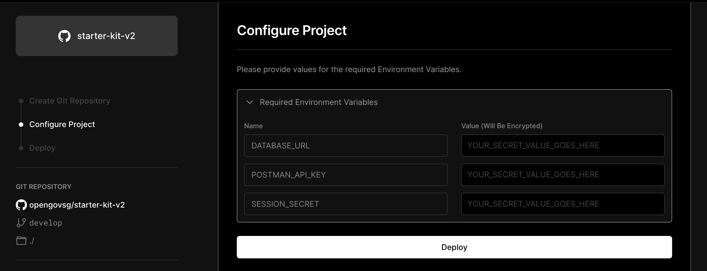
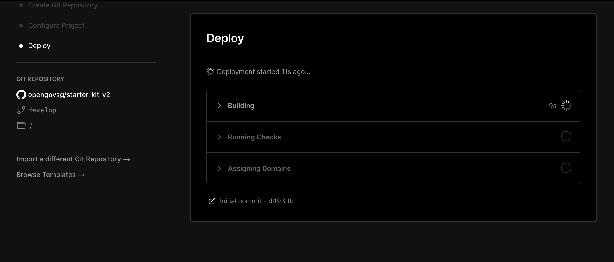

# Getting Started - Part 1: Environment Set Up

Read this if you are using Starter Kit for the first time, and want
some guidance with setting it up for your product

## Overview

We have deliberately designed the set-up process to take care of the
hosting of your product first. This allows you to take advantage of the
automation that is provided by some of the services that you will use. It
will also host the start of your codebase on GitHub, for you to work on 
at a later point.

### Objective

This guide, the first part of two, will take you through the following steps:
- Obtaining services for hosting
- Deploying to Vercel

By the end of this guide, you will have:
- A database to hold information that your product needs to function
- A copy of the Starter Kit codebase hosted on GitHub
- A copy of Starter Kit deployed to a managed hosting service

## Obtaining Services

We will obtain a couple of items for our hosted environment:
- A database service, to hold information for your product
- A key to access the API from [Postman](https://www.postman.gov.sg),
  for sending emails, including emails for logging into your product

### Database

We use [CockroachDB](https://www.cockroachlabs.com/) to host the database
for your product. 

Go to https://www.cockroachlabs.com/lp/serverless/, and login and create
your account. Set your Company Name to your project name.

Create a free serverless cluster with AWS as provider and Singapore as region

Create a sql user. Set it to anything other than `root`.

Save the connection string. You will need this later.

More information can be found in [this page](../../cockroach/README.md).

### Postman API

[Postman](https://www.postman.gov.sg) is the Singapore Government's
messaging service. It offers an API to send emails from your product,
accessible through a key unique to you.

To generate one, log into Postman, navigate to Settings and click on Generate API Key.

Copy the key. You will need this later.

Further information can be found in Postman's guide to 
[Generate your API Key](https://guide.postman.gov.sg/api-guide/generate-your-api-key).

## Deploying to Vercel

[Vercel](https://vercel.com) provides hosting for web applications, 
and offers a range of tools to aid with maintaining your product, including
integrations with GitHub.

Setting up Vercel for your product can be done via the deploy button found
in the Starter Kit [README](../../../README.md#deployment).

Vercel will then prompt you for a name to create a new 
GitHub repository to make a copy of the Starter
Kit code base, from where you will start working on your product.

Once you have chosen a name, click Create.

You will then be prompted to provide configuration. Expand
the Required Environment Variables section.

The deployment needs a few environment variables to be set for it to function. 

They are:

| Name | What It Is |
|-|-|
|`DATABASE_URL`| The connection string for your database |
|`POSTMAN_API_KEY`| An API key to send email via Postman |
|`SESSION_SECRET`| A sequence of random characters used to protect session identifiers, generated by running the command `npx uuid` from your terminal |

Your copy of Starter Kit will then start to deploy.

## What's Next

Now that your environment is set up, we will learn how to
interact with the codebase for your newly-created product
in Part 2.
