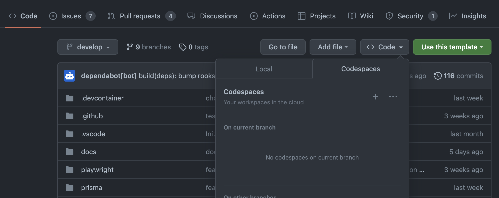
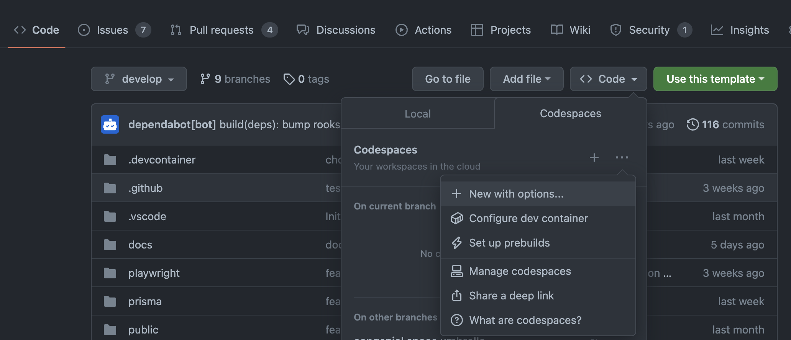
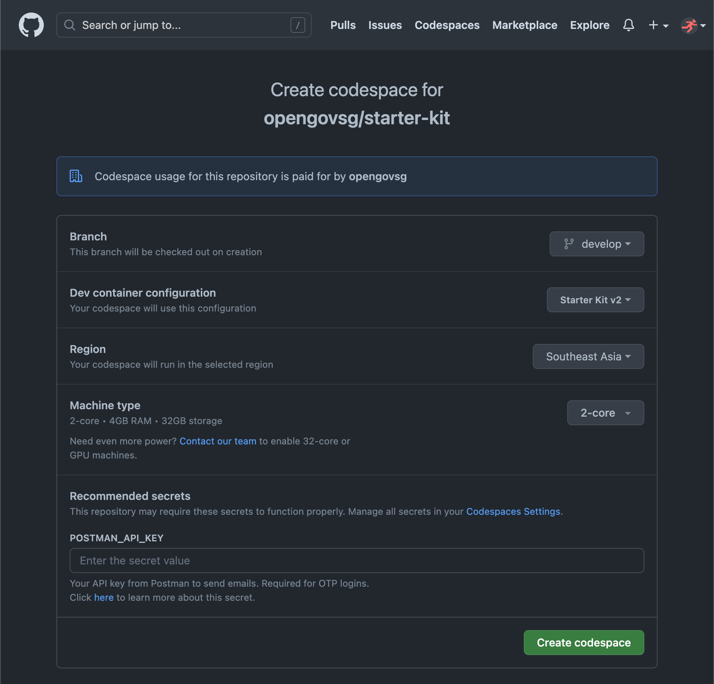
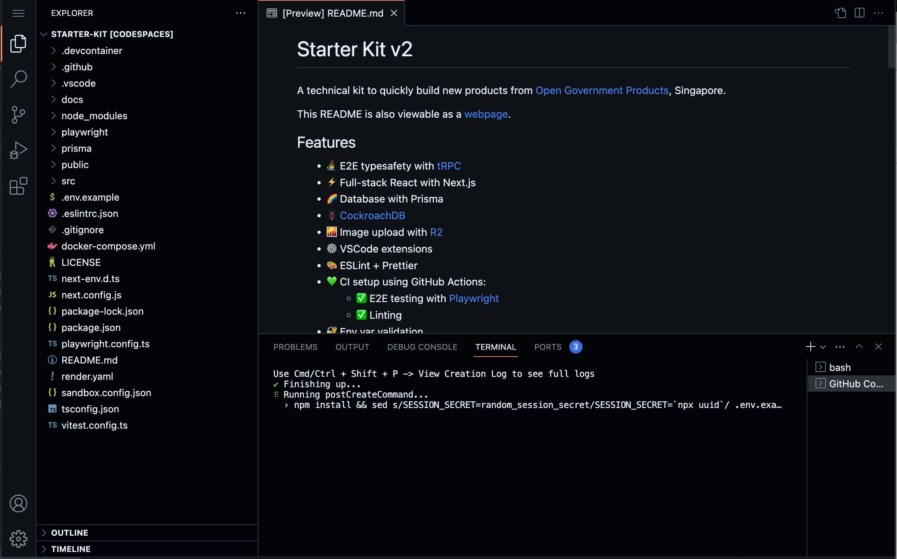
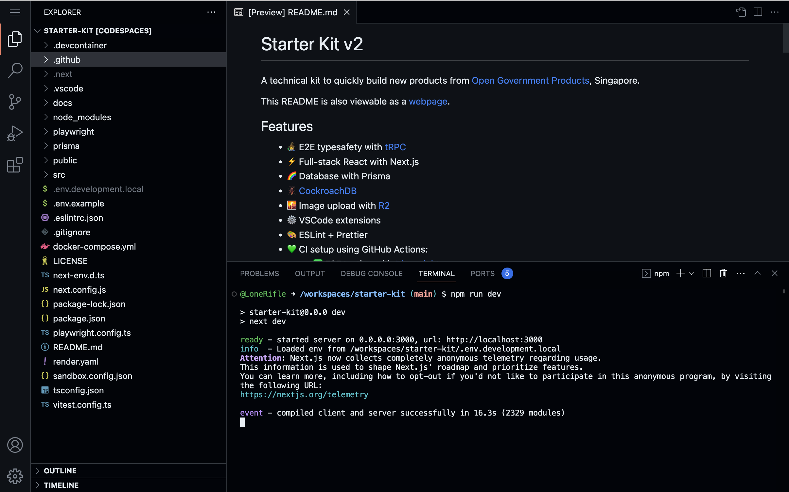
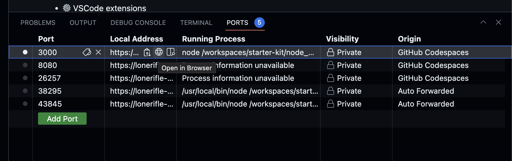
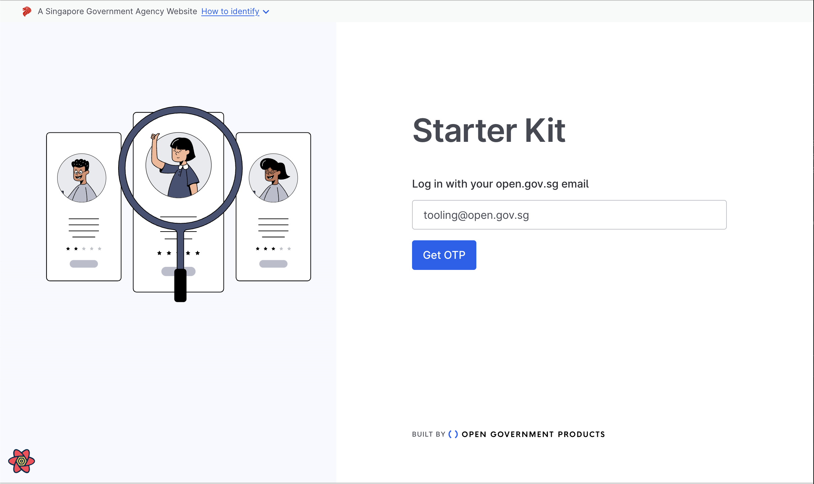
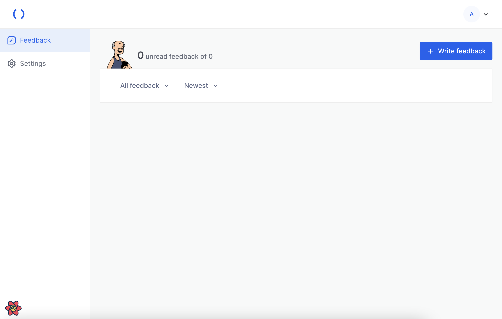

# Getting Started - Part 2: Coding with Codespaces

Read this after you are done with 
[Part 1](../getting-started-1/README.md), and are learning to
write code for your product using GitHub Codespaces

## Overview

To ensure a consistent developer experience, we encourage the use 
of GitHub Codespaces, an in-browser coding environment built around
Visual Studio Code. Since this guide has been written with that
in mind, developers who are more familiar working on their local
machine may want to adapt the instructions here to suit their own
set-ups.

### Objective

This guide, the second part of two, will take you through the following:
- Creating a GitHub Codespace for your work

By the end of this guide, you will have:
- Familiarised yourself with using GitHub Codespaces for your coding work

## Launching a Codespace

Using your browser, navigate to GitHub repository you have created in Part 1,
and select Code -> Codespaces.

Click or tap on the three dots, and select `New with options...`.

In the following screen, GitHub may prompt you to supply an API key for Postman, 
if you have not done so previously. This is to grant the Codespaces you create the
ability to interact with Postman to send emails.

You will then be presented with Visual Studio Code running in your browser.
Wait for the post-create command to finish, and to be presented with a terminal.

Verify that your set up is complete by typing `npm run dev` into the terminal,
and wait for your application to be built.

Click the ports tab in the bottom pane. Find port 3000, and click the globe
to Open in Browser.

Your application should load, showing the login page. Attempt to log in
by using your email and entering the OTP that subsequently gets sent.

You may have to wait for a while as the next screen gets compiled before
loading. Verify that you have successfully logged in by confirming that
this screen:

## What's Next

By completing parts 1 and 2 of the Getting Started guide, 
you have now successfully set up:
- Your GitHub repository for your codebase
- A Vercel account to deploy your application to
- A GitHub Codespace so that you can work on your application from anywhere
