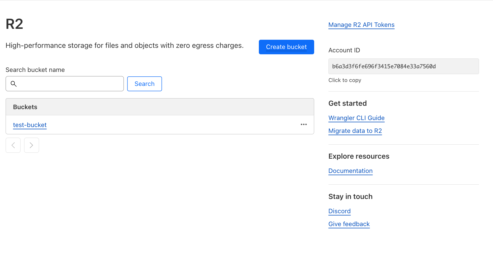
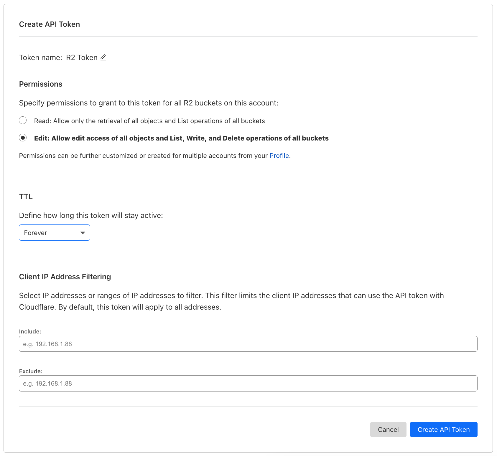
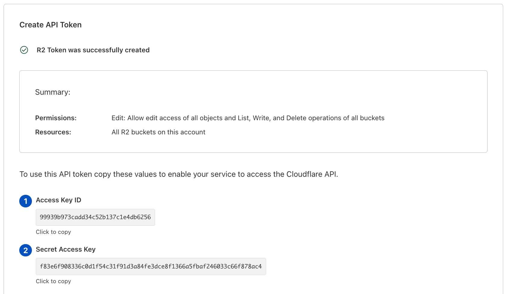
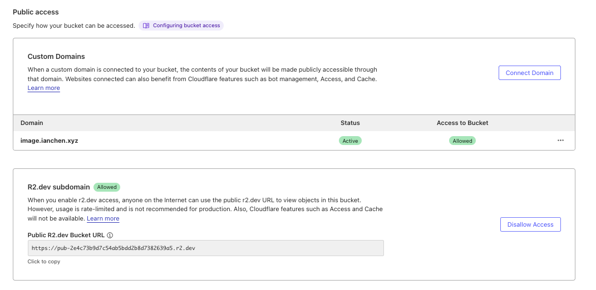

# R2 Setup

## Setup Instructions

1. Copy Account ID and create a bucket.
   
1. Create API Token with edit access. (Warning: this api token applies to all buckets)
   
1. Copy api key and secret
   
1. Allow public edit access to the bucket
   
1. Set custom domain for the bucket
   
1. Set CORS to allow for your domain
   

Set the following environment variables:

- `R2_ACCOUNT_ID`: **Your Cloudflare Account ID**
- `R2_BUCKET_NAME`: **Your Cloudflare Bucket Name**
- `R2_ACCESS_KEY_ID`: **R2 Access Key ID**
- `R2_SECRET_ACCESS_KEY`: **R2 Secret Access Key**
- `R2_PUBLIC_HOSTNAME`: **Your custom/dev public subdomain e.g. image.example.com**
