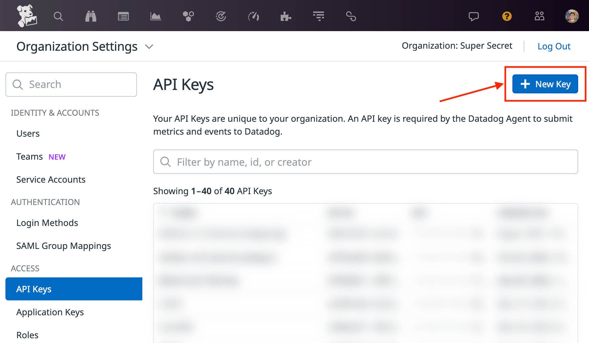
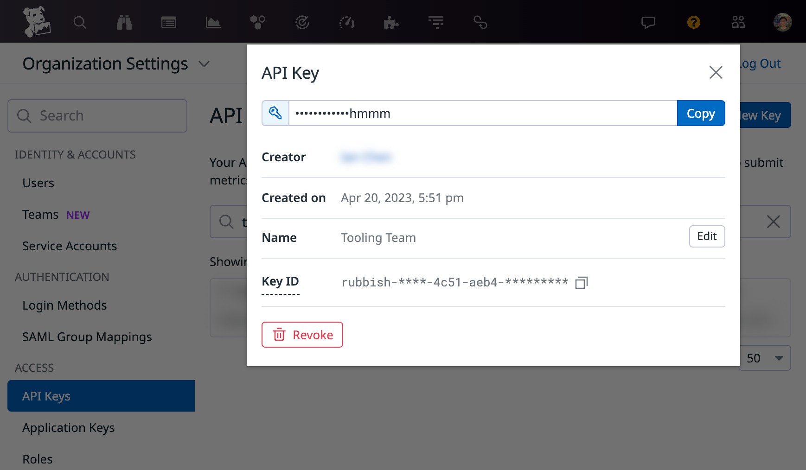
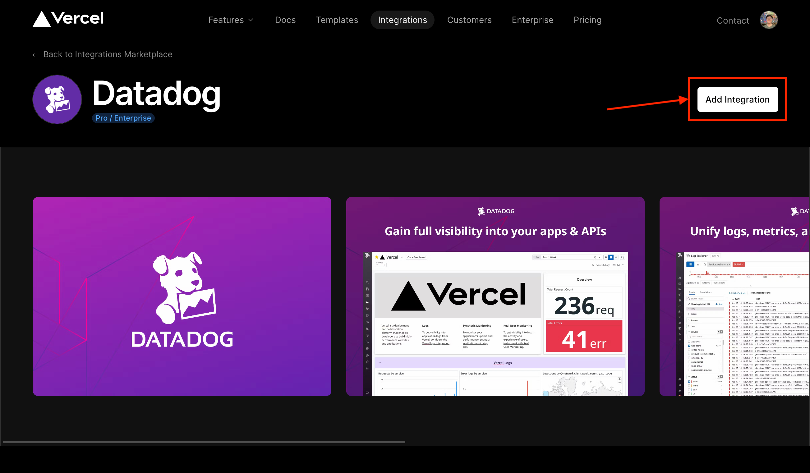
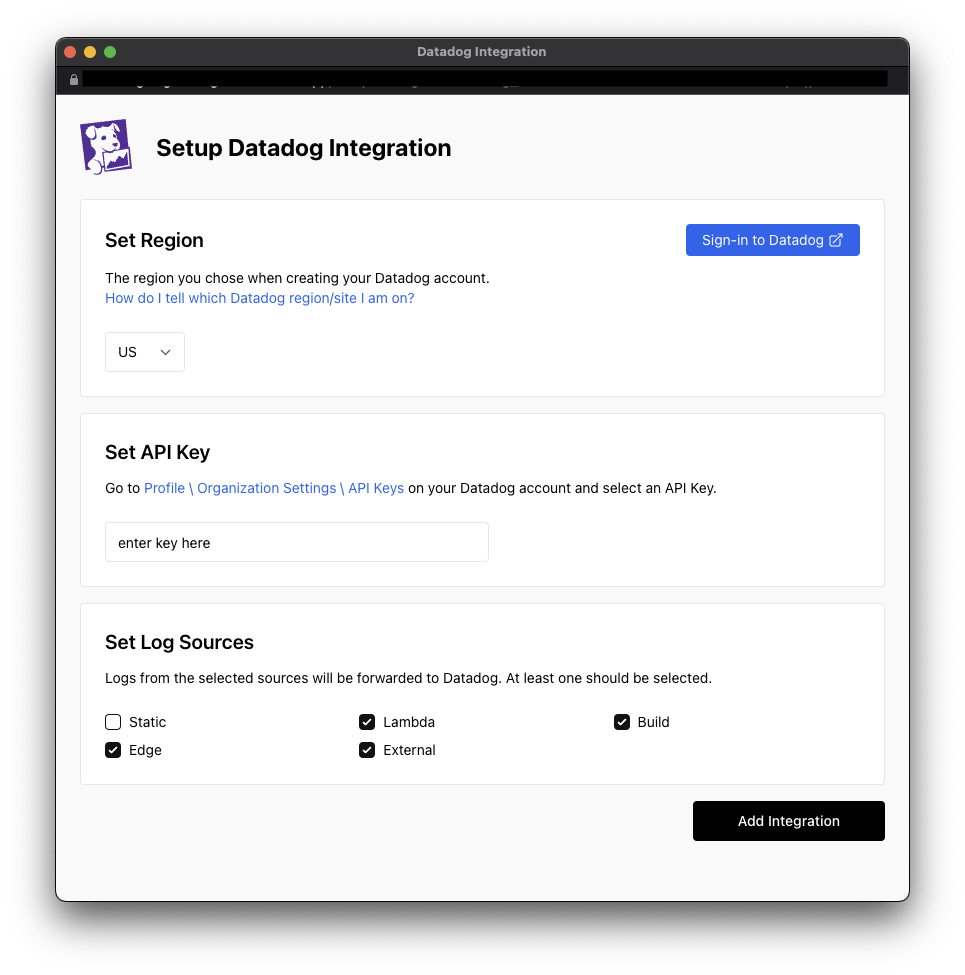
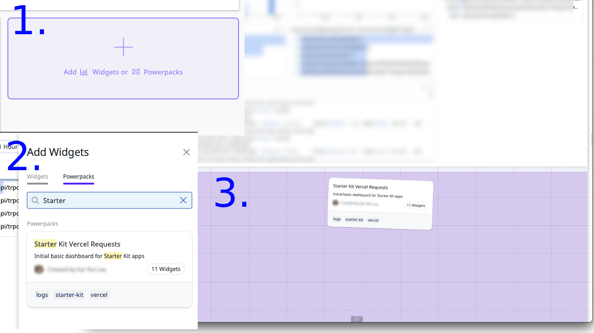
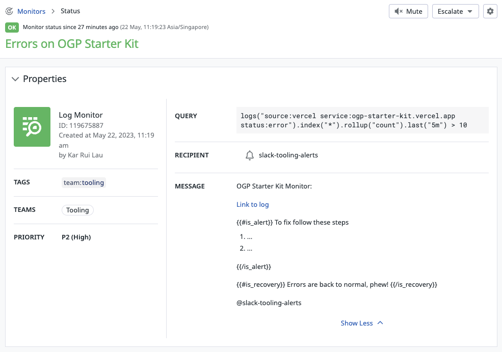

# Logging and Monitoring

Vercel provides runtime logs, which include all logs generated by the Serverless (basically the `pages/api` directory) and Edge Function (currently not used by this starter kit) invocations of our application. However, Vercel's logging limitations may be insufficient for proper monitoring and alerts.

There may be a need to augment the runtime logs with structured logs from your application with [Datadog](https://www.datadoghq.com/) for aggregation and analysis.

This document will describe how to view runtime logs in Vercel, and how to augment runtime logs with structured logs from your application with Datadog if the need arises.

## Viewing runtime logs (in Vercel)

To view runtime logs, click the Logs tab from your project overview in the dashboard. From here you can view, filter, and search through the runtime logs. Each log row shares basic info about the request like execution, domain name, HTTP status, function type, and RequestId.

You can view runtime logs for both preview and production deployments.

For more information on how to parse, filter, and search through runtime logs, see [Vercel's documentation](https://vercel.com/docs/concepts/observability/runtime-logs).

### Limitations

However, there are some limitations to the runtime logs in Vercel that may affect our ability to monitor the application. Runtime logs are only stored for the following limits:

| Plan       | Retention time | Log entries                       |
| ---------- | -------------- | --------------------------------- |
| Hobby      | 1 hour of logs | 4000 rows of log data             |
| Pro        | 1 hour of logs | 4000 rows of log data             |
| Enterprise | 3 days of logs | Up to 60 million rows of log data |

If the log entry limits are exceeded, only the most recent logs can be queried, and therefore the logs may need to be piped to another service such as Datadog for longer retention.

## Datadog

Datadog enables you to ingest logs from your application for analysis and storage, which may be useful for monitoring and alerts and bypasses Vercel's anemic retention time. This section will describe how to set up Datadog to ingest logs from your application.

### Set up Datadog-Vercel integration

Datadog provides an integration to pipe logs generated by your Vercel-hosted application into Datadog.

Integrate Vercel with Datadog to:

- View and parse your application logs using Datadog’s Log Management
- See the number of requests and 4xx/5xx HTTP errors to your serverless applications and APIs running on Vercel
- Monitor frontend performance with Datadog Synthetics

To set up the integration, follow the steps below:

1. Generate a [Datadog API key](https://app.datadoghq.com/organization-settings/api-keys).
   > If you do not have proper permissions, reach out to someone who does to generate the API key

2. Take note of the API key to be used in the next steps.

3. Go to [Datadog integration page](https://vercel.com/integrations/datadog) in Vercel marketplace and add the integration

4. In the integration set up page, enter the API key generated in step 1 and click "Add Integration"

The integration should have been added successfully. Now we head to Datadog to set up the dashboard for your application.

5. Go to Datadog dashboards and search for "Vercel", or click [here](https://app.datadoghq.com/dashboard/lists?q=vercel). The default Vercel dashboard should show up as an option. You should clone the dashboard and add the specific service for ease of modification for other items you may want to monitor.

Alternatively, you can create a new dashboard and add the widgets you want to monitor. We have created a powerpack for you to use as a starting point. You can use the powerpack by:
1. Going to your dashboard and clicking the "Add Widgets or Powerpack" button,
2. Searching for "Starter Kit Vercel Requests", 
3. Then drag and drop the powerpack into your dashboard.

With the dashboards, you can proceed to add basic alerts and monitors for your application.

Below is an example of a Datadog monitor that tracks errors on the Vercel application and alerts a configured Slack channel. The monitor can also be found in by searching for "Starter Kit" on [Datadog's monitor page](https://app.datadoghq.com/monitors/manage).

> To add a Slack channel, or BetterUptime integration, follow their respective documentation that can be found in the Useful Resources section of this document.

## Useful Resources

| Resource                    | Link                                                            |
| --------------------------- | --------------------------------------------------------------- |
| Vercel Runtime Logs         | https://vercel.com/docs/concepts/observability/runtime-logs     |
| Vercel Serverless Functions | https://vercel.com/docs/concepts/functions/serverless-functions |
| Vercel Datadog integration  | https://vercel.com/integrations/datadog                         |
| Adding Slack channel to Datadog | https://docs.datadoghq.com/integrations/slack/ |
| Adding BetterUptime integration to Datadog | https://betterstack.com/docs/uptime/datadog/ |
